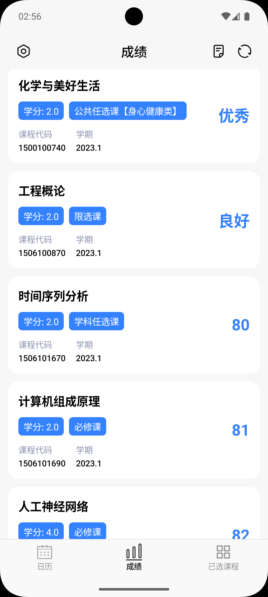
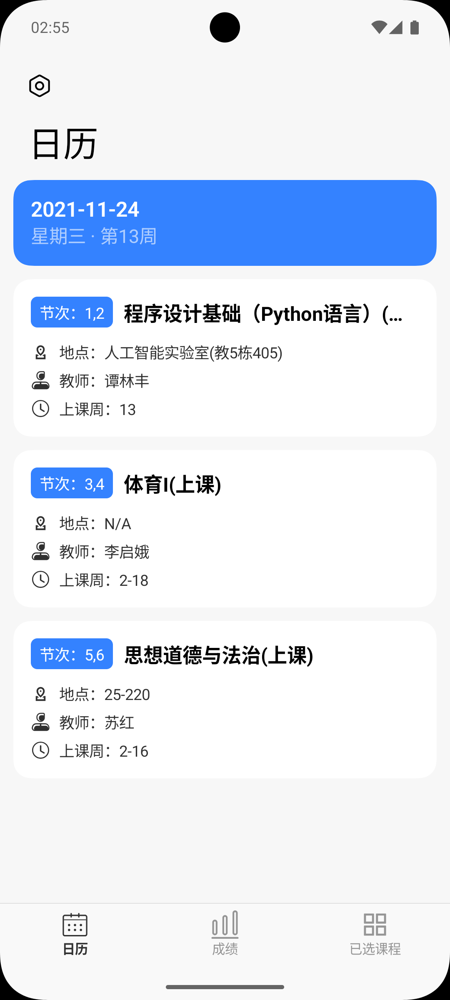
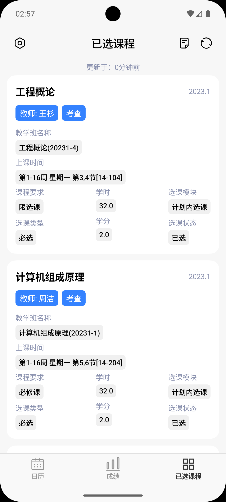
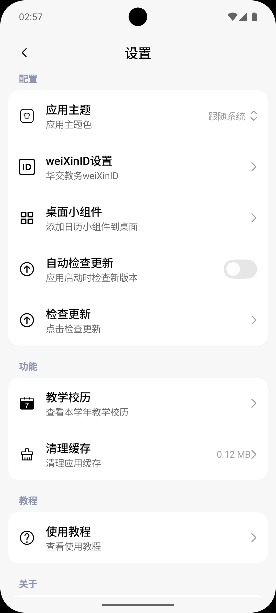
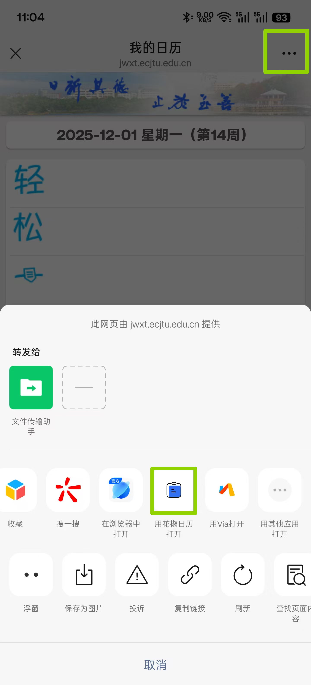

# 花椒日历

适用于华东交通大学的课表应用

## 功能列表

- [x] 课表查询（基于华交教务微信公众号我的日历功能）
- [x] 成绩查询
- [x] 已选课程查看
- [x] 校历查看
- [ ] 学生办事指南链接
- [ ] 空教室查询
- [ ] 学分统计/素拓学分查询
- [ ] 考试安排查询

## 为什么选择本应用？

大部分课表应用都是通过登录学校的教务系统获取学期课表，

然而当老师的课程安排有变化，课表无法自动实时更新，

因此，我一般都使用**华交教务**微信公众号的**我的日历**功能，但这种方法查看课程需要分三步：

- 打开小而美的微信
- 打开华交教务公众号
- 在**更多功能**里找到**我的日历**并点开，查看课程

此外，如果要查看指定日期的课程，使用上述两种方法都存在弊端。

使用本应用则可以避免以上所有问题。

## 应用截图

| 成绩查询                                                                            | 日历视图                                                                            | 已选课程                                                                                | 设置界面                                                                            |
|---------------------------------------------------------------------------------|---------------------------------------------------------------------------------|-------------------------------------------------------------------------------------|---------------------------------------------------------------------------------|
|  |  |  |  |

## 如何使用

1. 首先，打开**华交教务**微信公众号，点击更多功能，点击**我的日历**

2. 点击右上角三点，点击**用花椒日历打开**，应用会自动读取weiXinID并保存

## 注
- 如果不想使用本应用，你也可以使用[via浏览器](https://viayoo.com/zh-cn)将第2步中复制的链接作为快捷方式添加到桌面

## 特别感谢
- 应用图标来源于[阿里矢量图标库](https://www.iconfont.cn/)

## 其他项目
- [ECJTU-AutoLogin](https://github.com/Replica0110/ECJTU-AutoLogin)
   - 校园网登录工具，Windows桌面端见 [ECJTU-AutoLogin-Desktop](https://github.com/Replica0110/ECJTU-AutoLogin-Desktop)
- [ECJTU-PDA](https://github.com/Replica0110/ECJTU-PDA)
   - 华东交通大学学生信息查询应用，支持课程查询、成绩查询、个人信息查询、校园网登录及其他教务系统相关的功能（开发中）
