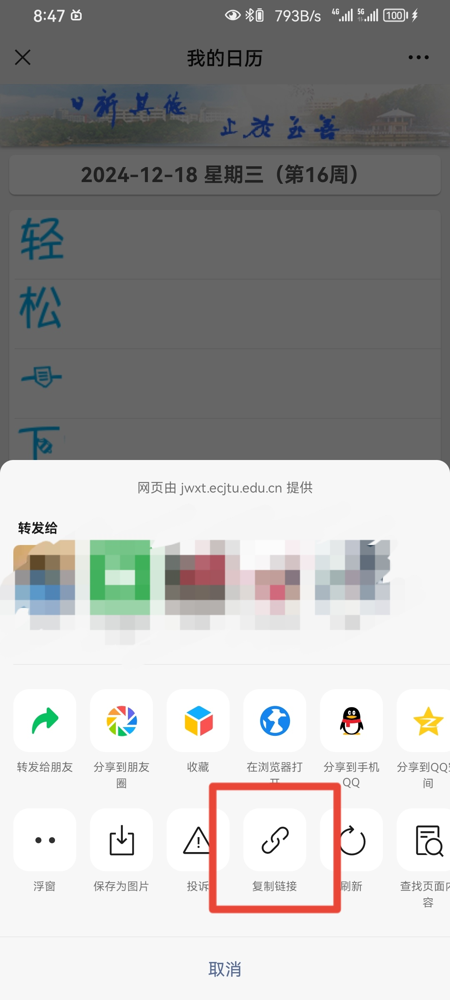

# 花椒日历

适用于华东交通大学的课表应用，~~实际上是个日历应用~~

## 为什么选择本应用？

大部分课表应用都是通过登录学校的教务系统获取学期课表，

如果老师的课程安排有变化，课表也无法实时更新，

因此，我一般都使用**华交教务**微信公众号的**我的日历**功能，然而这种方法查看课程需要分三步：

- 打开小而美的微信
- 找到并打开华交华交教务公众号
- 在**更多功能**里找到**我的日历**并点开，查看课程

此外，如果要查看指定日期的课程，使用上述两种方法都有弊端，~~懂的都懂~~。

使用本应用则可以规避以上所有问题。

## 应用特点

- 基于 Material 设计，界面美观  ~~(至少符合我的审美，欢迎会ui设计的同学提交issue)~~

- 加载速度~~应该很~~快  ~~(虽然是屎山代码写出来的项目，但毕竟没学过安卓，不得不说ai和搜索引擎真是两个伟大的发明啊)~~
- 配置简单，只需要在**华交教务**中获取**weiXinID**并填入到应用中就可使用  ~~(毕竟本应用就是通过解析日历网页源代码实现的，同理也可以实现对考试安排界面的解析，不过目前不想做)~~

- 查看课程方便，可通过日期选择快速查看指定日期的课程

- 桌面小组件功能，可查看今天和明天课程~~(开发小组件比我想象中困难)~~

- 没了

## 如何使用

1. 首先，打开**华交教务**微信公众号，点击更多功能，点击**我的日历**

2. 打开日历，点击右上角三点，选择在浏览器打开

3. 点击地址栏的链接并复制（如果你知道怎么查看网址中的`weiXinID`参数，也可复制后直接跳转到第6步）

4. 将复制的链接粘贴到任意文本编辑器（例如备忘录~~或者QQ~~），查看链接中`weiXinID=`后面的字段，复制这段文本

6. 打开**花椒日历**，在设置页找到**weiXinID设置**，点击后填入刚刚复制的`weiXinID`，保存后在日历页面下拉或长按日期选择按钮即可刷新

## 特别感谢
- 应用的所有图标都来源于[阿里矢量图标库](https://www.iconfont.cn/)
